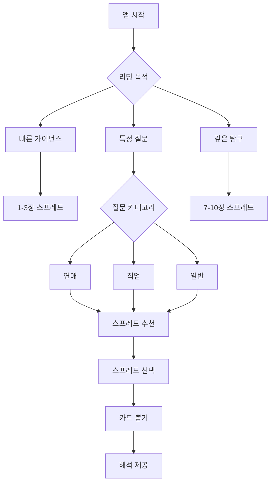

# 🔮 타로 리딩 플로우 기획서
## Tarot Reading Flow & Spread System Design Document

---

## 📌 목차
1. [개요](#개요)
2. [타로 스프레드 체계](#타로-스프레드-체계)
3. [주제별 최적 스프레드 매칭](#주제별-최적-스프레드-매칭)
4. [핵심 스프레드 상세 설계](#핵심-스프레드-상세-설계)
5. [사용자 플로우 설계](#사용자-플로우-설계)
6. [AI 해석 시스템](#ai-해석-시스템)
7. [UX/UI 플로우](#uxui-플로우)
8. [개인화 추천 시스템](#개인화-추천-시스템)

---

## 1. 개요

### 1.1 목적
본 문서는 TarotMind 앱의 타로 리딩 플로우를 체계적으로 설계하여, 사용자가 자신의 상황과 질문에 가장 적합한 타로 스프레드를 선택하고 의미있는 해석을 받을 수 있도록 하는 시스템을 구축하는 것을 목적으로 합니다.

### 1.2 타로 스프레드의 중요성
타로 스프레드는 각 카드가 특정한 역할을 수행하는 신중하게 선택된 레이아웃으로, 단순한 답변이 아닌 명확성, 방향성, 실행 가능한 통찰력을 제공합니다. 올바른 스프레드 선택은 리딩의 정확성과 유용성을 크게 향상시킵니다.

### 1.3 설계 원칙
- **단순성**: 초보자도 쉽게 이해할 수 있는 직관적 구조
- **깊이**: 경험자도 만족할 수 있는 심층적 해석
- **유연성**: 다양한 상황에 적용 가능한 범용성
- **개인화**: 사용자별 맞춤 스프레드 추천

---

## 2. 타로 스프레드 체계

### 2.1 스프레드 분류 체계

#### 카드 수에 따른 분류
| 카드 수 | 난이도 | 소요 시간 | 적합 상황 | 사용자 레벨 |
|---------|--------|-----------|-----------|-------------|
| 1장 | ⭐ | 1-2분 | 일일 가이던스, Yes/No | 초급 |
| 3장 | ⭐⭐ | 3-5분 | 빠른 상황 파악 | 초급 |
| 5장 | ⭐⭐⭐ | 5-10분 | 상세 분석 | 중급 |
| 7장 | ⭐⭐⭐⭐ | 10-15분 | 복잡한 문제 | 중급 |
| 10장 | ⭐⭐⭐⭐⭐ | 15-20분 | 전체적 통찰 | 고급 |
| 10장+ | ⭐⭐⭐⭐⭐⭐ | 20분+ | 심층 분석 | 전문가 |

#### 주제별 분류
| 카테고리 | 주요 관심사 | 추천 스프레드 |
|----------|------------|--------------|
| 💕 연애/관계 | 궁합, 미래, 갈등 해결 | Relationship, Love Triangle, Soulmate |
| 💼 직업/경력 | 이직, 승진, 적성 | Career Path, Decision Making, Success |
| 💰 재정/금전 | 투자, 수입, 지출 | Money Flow, Abundance, Financial |
| 🌟 일반/운세 | 전반적 상황, 조언 | Celtic Cross, Daily Card, Horseshoe |
| 🧘 영성/성장 | 자아 탐구, 치유 | Chakra, Tree of Life, Pentagram |
| ⚖️ 의사결정 | 선택, 방향성 | Two Paths, Crossroads, Decision |

---

## 3. 주제별 최적 스프레드 매칭

### 3.1 연애/관계 분야

#### 💕 싱글을 위한 스프레드

##### "새로운 사랑" 스프레드 (5장)
```
    [3]
 [1] [2] [4]
    [5]

1. 현재 나의 준비 상태
2. 다가올 인연의 특징
3. 만남의 시기/장소
4. 주의할 점
5. 조언
```

**적합한 질문**:
- "언제 연애를 시작할 수 있을까?"
- "어떤 사람을 만나게 될까?"
- "내가 준비해야 할 것은?"

##### "자기사랑" 스프레드 (3장)
```
[1] [2] [3]

1. 내가 사랑해야 할 나의 모습
2. 치유가 필요한 부분
3. 성장 방향
```

#### 💑 커플을 위한 스프레드

##### "관계 현황" 스프레드 (7장)
관계 스프레드는 두 파트너의 관점과 관계 전체를 탐구하며, 15장을 사용하는 Co-walkers 스프레드는 모든 관계(배우자, 상사, 친구, 동료 등)에 사용 가능합니다.

```
   [1]   [2]
[3] [4] [5] [6]
      [7]

1. 나의 감정
2. 상대방의 감정  
3. 과거 기반
4. 현재 상태
5. 숨겨진 영향
6. 미래 가능성
7. 관계 조언
```

**적합한 질문**:
- "우리 관계의 현재 상태는?"
- "상대방은 나를 어떻게 생각할까?"
- "관계 개선을 위해 필요한 것은?"

##### "궁합" 스프레드 (6장)
```
[1]     [2]
[3]     [4]
[5]     [6]

좌측: 나 / 우측: 상대방
1,2: 성격과 가치관
3,4: 사랑의 표현 방식
5,6: 장기적 호환성
```

#### 💔 이별/치유를 위한 스프레드

##### "이별 극복" 스프레드 (5장)
이별 스프레드는 나의 역할, 상대방의 역할, 외부 요인, 내가 얻은 것, 배울 점으로 구성되어 이별의 이유를 이해하고 긍정적으로 나아가도록 도와줍니다.

```
      [4]
[1] [2] [3]
      [5]

1. 나의 역할
2. 상대방의 역할
3. 외부 요인
4. 내가 얻은 것
5. 앞으로 나아갈 방향
```

### 3.2 직업/경력 분야

#### 💼 경력 개발 스프레드

##### "커리어 패스" 스프레드 (7장)
```
          [7]
    [5]        [6]
[1] [2] [3] [4]

1. 현재 위치
2. 강점
3. 약점/개선점
4. 기회
5. 단기 목표 (6개월)
6. 장기 목표 (2-3년)
7. 최종 비전
```

**적합한 질문**:
- "내 커리어 방향이 맞는가?"
- "어떤 기술을 개발해야 하는가?"
- "승진 가능성은?"

#### 🤝 이직/전직 스프레드

##### "의사결정" 스프레드 (5장)
의사결정 스프레드는 동기, 이상적 결과, 가치관, 첫 번째 경로의 결과, 두 번째 경로의 결과를 보여주어 중요한 결정을 내리는데 도움을 줍니다.

```
[1]
[2] [3]
[4] [5]

1. 핵심 동기
2. 현재 직장 유지 시
3. 새 직장 선택 시
4. 현재 경로의 장기 결과
5. 새로운 경로의 장기 결과
```

### 3.3 일반 운세/가이던스

#### 🌟 일일 가이던스

##### "데일리 카드" (1장)
- **목적**: 오늘 하루의 에너지와 조언
- **해석 포인트**: 
  - 카드의 전체적 에너지
  - 오늘 주의할 점
  - 기회 포착 방법

##### "아침 점검" 스프레드 (3장)
```
[1] [2] [3]

1. 오늘의 전반적 에너지
2. 도전/주의사항
3. 조언/기회
```

#### 🔮 종합 운세

##### "켈틱 크로스" 스프레드 (10장)
켈틱 크로스는 가장 유명하고 널리 사용되는 타로 스프레드로, 10장의 카드로 과거 영향, 현재 도전, 미래 가능성을 포함한 깊은 통찰을 제공하며, 특정 질문이 없을 때도 사용 가능합니다.

```
        [10]
         |
    [9]  |
     |   |
    [8]  |
     |   |  [3]
    [7] [1][2] [5]
         [6]
         [4]

크로스 부분 (1-6):
1. 현재 상황
2. 도전/장애물
3. 과거 영향
4. 가까운 미래
5. 가능한 결과
6. 즉각적 영향

스태프 부분 (7-10):
7. 자신의 입장
8. 외부 영향
9. 희망과 두려움
10. 최종 결과
```

**켈틱 크로스 해석 팁**:
카드 간 관계를 분석하는 것이 중요합니다. 특히 의식(5번)과 무의식(6번) 카드를 비교하고, 가까운 미래(4번)가 최종 결과(10번)에 어떻게 영향을 미치는지 확인해야 합니다.

##### "호스슈(말굽)" 스프레드 (7장)
호스슈 스프레드는 과거, 현재, 숨겨진 영향, 조언, 외부 영향, 장애물, 결과를 보여주는 7장 스프레드로, 인생의 길을 GPS처럼 안내하며 결정이 필요할 때 완벽합니다.

```
[1]           [7]
  [2]       [6]
    [3] [4] [5]

1. 과거 영향
2. 현재 상황
3. 숨겨진 영향
4. 조언
5. 외부 영향
6. 장애물
7. 예상 결과
```

### 3.4 영성/자기계발

#### 🧘 차크라 스프레드 (7장)
```
[7] 크라운 - 영적 연결
[6] 제3의 눈 - 직관
[5] 목 - 의사소통
[4] 하트 - 사랑
[3] 태양신경총 - 개인 파워
[2] 천골 - 창의성
[1] 루트 - 안정성
```

**목적**: 에너지 균형 점검, 차크라별 상태 진단

#### ⭐ 펜타그램 스프레드 (5장)
펜타그램 스프레드는 지구(물질), 공기(지성), 불(열정), 물(감정), 영혼(영성)의 5가지 원소를 나타내며, 삶의 균형과 조화를 찾는데 도움을 줍니다.

```
      [5]
   [2]   [3]
    [1]
  [4]   [5]

1. 지구 - 물질적 측면
2. 공기 - 사고와 소통
3. 불 - 열정과 의지
4. 물 - 감정과 직관
5. 영혼 - 영적 메시지
```

---

## 4. 핵심 스프레드 상세 설계

### 4.1 초급자용 스프레드 (1-3장)

#### "Yes/No" 스프레드 (1장)
**프로세스**:
1. 명확한 Yes/No 질문 구성
2. 카드 한 장 뽑기
3. 정방향/역방향 해석
4. 보조 메시지 제공

**해석 규칙**:
- 정방향 긍정 카드 → Yes (70-90%)
- 역방향 긍정 카드 → Maybe (40-60%)
- 정방향 부정 카드 → Maybe (40-60%)
- 역방향 부정 카드 → No (10-30%)

#### "과거-현재-미래" 스프레드 (3장)
3장 스프레드는 과거, 현재, 미래의 영향을 탐구하여 상황의 진행을 이해하고 정보에 기반한 의사결정을 가능하게 하는 기초적인 레이아웃입니다.

**변형 버전**:
- 상황 - 행동 - 결과
- 마음 - 몸 - 영혼
- 나 - 상대방 - 관계
- 문제 - 원인 - 해결책

### 4.2 중급자용 스프레드 (5-7장)

#### "크로스" 스프레드 (5장)
크로스 스프레드는 현재 상황, 잠재적 도전, 권장 행동, 가능한 결과, 근본 요인을 다루어 문제 해결에 완벽합니다.

```
    [3]
[2] [1] [4]
    [5]

1. 현재 상황 (중심)
2. 도전/장애물 (좌)
3. 권장 행동 (상)
4. 가능한 결과 (우)
5. 근본 원인 (하)
```

**해석 순서**:
1. 중심 카드로 핵심 파악
2. 좌우 카드로 역동성 이해
3. 상하 카드로 깊이 추가
4. 전체 패턴 종합

### 4.3 고급자용 스프레드 (10장+)

#### "연간 스프레드" (13장)
```
12개월 + 1장 (연간 테마)

[1] 1월 - 새로운 시작
[2] 2월 - 관계
[3] 3월 - 성장
...
[12] 12월 - 완성
[13] 연간 테마 카드
```

**활용법**:
- 신년 계획 수립
- 월별 포커스 설정
- 분기별 체크인

---

## 5. 사용자 플로우 설계

### 5.1 리딩 선택 플로우



### 5.2 단계별 사용자 경험

#### Step 1: 의도 설정
```javascript
const IntentionSetting = {
  prompts: [
    "오늘 무엇을 알고 싶으신가요?",
    "마음속 질문을 떠올려 보세요",
    "깊은 숨을 쉬고 집중하세요"
  ],
  duration: "30-60초",
  background: "명상 음악",
  animation: "촛불 또는 별 효과"
};
```

#### Step 2: 카테고리 선택
```javascript
const CategorySelection = {
  options: [
    { icon: "❤️", label: "연애", count: "8개 스프레드" },
    { icon: "💼", label: "직업", count: "6개 스프레드" },
    { icon: "💰", label: "재정", count: "4개 스프레드" },
    { icon: "🌟", label: "일반", count: "10개 스프레드" },
    { icon: "🧘", label: "영성", count: "5개 스프레드" }
  ],
  recommendation: "AI 기반 추천"
};
```

#### Step 3: 스프레드 선택
```javascript
const SpreadSelection = {
  display: {
    visual: "스프레드 모양 프리뷰",
    difficulty: "난이도 표시",
    time: "예상 소요 시간",
    description: "간단한 설명"
  },
  filters: {
    cardCount: [1, 3, 5, 7, 10],
    difficulty: ["초급", "중급", "고급"],
    popularity: "인기도 정렬"
  }
};
```

#### Step 4: 카드 셔플 & 선택
```javascript
const CardInteraction = {
  shuffle: {
    type: "physics_based",
    duration: 3000,
    sound: "카드 섞는 소리",
    haptic: true
  },
  selection: {
    method: "tap_to_select",
    animation: "glow_effect",
    feedback: "진동 + 소리"
  }
};
```

#### Step 5: 해석 제공
```javascript
const InterpretationDelivery = {
  format: {
    overview: "전체 요약",
    cardByCard: "개별 카드 해석",
    synthesis: "종합 메시지",
    advice: "실천 조언"
  },
  features: {
    tts: "음성 읽기",
    save: "저장 기능",
    share: "공유 옵션",
    journal: "일기 연동"
  }
};
```

---

## 6. AI 해석 시스템

### 6.1 카드 조합 분석

#### 패턴 인식 시스템
카드 패턴 분석 시 메이저 아르카나가 많으면 큰 교훈이나 운명적 요소, 마이너가 많으면 일상적 문제, 특정 슈트가 많으면 해당 영역의 집중, 숫자 패턴은 상황의 진행 단계를 나타냅니다.

```python
class PatternAnalyzer:
    def analyze_spread(self, cards):
        patterns = {
            'major_minor_ratio': self.calculate_arcana_ratio(cards),
            'suit_distribution': self.analyze_suits(cards),
            'number_patterns': self.find_number_patterns(cards),
            'element_balance': self.check_elements(cards),
            'card_relationships': self.find_relationships(cards)
        }
        return patterns
    
    def interpret_patterns(self, patterns):
        interpretations = []
        
        # 메이저 아르카나 비율 해석
        if patterns['major_minor_ratio'] > 0.5:
            interpretations.append("중요한 인생의 전환점")
        
        # 숫자 패턴 해석
        if patterns['number_patterns']['aces'] >= 2:
            interpretations.append("새로운 시작의 에너지")
        
        # 원소 균형 해석
        if patterns['element_balance']['fire'] > 0.4:
            interpretations.append("행동과 열정이 필요한 시기")
        
        return interpretations
```

### 6.2 개인화 해석 엔진

#### 컨텍스트 기반 해석
```python
class PersonalizedInterpreter:
    def generate_interpretation(self, spread_data, user_context):
        base_interpretation = self.get_base_meaning(spread_data)
        
        # 사용자 컨텍스트 적용
        personalized = self.apply_context({
            'question': user_context['question'],
            'category': user_context['category'],
            'user_history': user_context['past_readings'],
            'life_situation': user_context['current_situation']
        })
        
        # 톤 조정
        final_interpretation = self.adjust_tone(
            personalized,
            user_context['preferred_style']
        )
        
        return final_interpretation
```

### 6.3 해석 품질 보증

#### 일관성 체크
```python
def validate_interpretation(interpretation, cards, spread_type):
    checks = {
        'relevance': check_relevance_to_question(),
        'accuracy': verify_card_meanings(),
        'coherence': ensure_logical_flow(),
        'completeness': check_all_positions_covered(),
        'tone': verify_appropriate_tone()
    }
    
    score = calculate_quality_score(checks)
    if score < 0.8:
        return regenerate_interpretation()
    
    return interpretation
```

---

## 7. UX/UI 플로우

### 7.1 인터페이스 설계

#### 스프레드 선택 화면
```javascript
const SpreadSelectionUI = {
  layout: "grid",
  components: {
    header: {
      title: "스프레드를 선택하세요",
      subtitle: "당신의 질문에 맞는 카드 배치"
    },
    filterBar: {
      chips: ["전체", "연애", "직업", "일반", "영성"],
      sort: ["인기순", "카드수", "난이도"]
    },
    spreadCards: {
      image: "visual_preview",
      title: "spread_name",
      tags: ["카드수", "소요시간", "난이도"],
      description: "brief_description"
    },
    recommendedSection: {
      title: "AI 추천 스프레드",
      algorithm: "user_history + current_mood + question_type"
    }
  }
};
```

#### 카드 배치 애니메이션
```javascript
const CardPlacementAnimation = {
  phases: [
    {
      name: "shuffle",
      duration: 3000,
      animation: "3d_shuffle",
      sound: "shuffle.mp3"
    },
    {
      name: "spread",
      duration: 2000,
      animation: "fan_out",
      sound: "whoosh.mp3"
    },
    {
      name: "selection",
      duration: 500,
      animation: "glow_and_lift",
      sound: "chime.mp3"
    },
    {
      name: "placement",
      duration: 800,
      animation: "fly_to_position",
      sound: "place.mp3"
    },
    {
      name: "reveal",
      duration: 600,
      animation: "flip_3d",
      sound: "reveal.mp3"
    }
  ]
};
```

### 7.2 반응형 레이아웃

#### 스프레드 표시 적응
```css
/* 켈틱 크로스 반응형 레이아웃 */
.celtic-cross {
  display: grid;
  gap: 10px;
  max-width: 600px;
  margin: 0 auto;
}

/* 모바일 (세로) */
@media (max-width: 480px) {
  .celtic-cross {
    grid-template-columns: repeat(3, 1fr);
    grid-template-rows: repeat(5, 1fr);
  }
}

/* 태블릿 */
@media (min-width: 481px) and (max-width: 768px) {
  .celtic-cross {
    grid-template-columns: repeat(4, 1fr);
    grid-template-rows: repeat(4, 1fr);
  }
}

/* 데스크톱 */
@media (min-width: 769px) {
  .celtic-cross {
    grid-template-columns: repeat(5, 1fr);
    grid-template-rows: repeat(4, 1fr);
  }
}
```

### 7.3 인터랙션 피드백

#### 햅틱 & 사운드 피드백
```javascript
const FeedbackSystem = {
  haptic: {
    cardSelect: { type: "impact", intensity: "light" },
    cardPlace: { type: "impact", intensity: "medium" },
    shuffleStart: { type: "impact", intensity: "heavy" },
    revealCard: { type: "notification", pattern: "success" }
  },
  sound: {
    ambient: "mystical_background.mp3",
    shuffle: "cards_shuffle.mp3",
    select: "card_select.mp3",
    place: "card_place.mp3",
    reveal: "card_reveal.mp3",
    interpretation: "chime_complete.mp3"
  },
  visual: {
    cardHover: "glow_effect",
    cardSelected: "lift_and_glow",
    spreadComplete: "sparkle_animation"
  }
};
```

---

## 8. 개인화 추천 시스템

### 8.1 사용자 프로파일링

#### 리딩 히스토리 분석
```python
class UserProfileAnalyzer:
    def analyze_reading_patterns(self, user_id):
        history = self.get_user_history(user_id)
        
        patterns = {
            'preferred_categories': self.count_categories(history),
            'average_card_count': self.avg_cards_used(history),
            'reading_frequency': self.calculate_frequency(history),
            'time_preferences': self.analyze_timing(history),
            'question_themes': self.extract_themes(history),
            'satisfaction_scores': self.get_ratings(history)
        }
        
        return self.create_user_profile(patterns)
```

### 8.2 스마트 스프레드 추천

#### 추천 알고리즘
```python
class SpreadRecommender:
    def recommend_spread(self, user_profile, current_context):
        candidates = []
        
        # 1. 질문 유형 기반 필터링
        question_type = self.classify_question(current_context['question'])
        suitable_spreads = self.filter_by_question(question_type)
        
        # 2. 사용자 선호도 점수 계산
        for spread in suitable_spreads:
            score = self.calculate_score(spread, user_profile)
            candidates.append((spread, score))
        
        # 3. 컨텍스트 가중치 적용
        candidates = self.apply_context_weights(
            candidates, 
            current_context
        )
        
        # 4. 상위 3개 추천
        return sorted(candidates, key=lambda x: x[1], reverse=True)[:3]
    
    def calculate_score(self, spread, profile):
        score = 0
        
        # 카드 수 선호도
        if spread.card_count == profile['preferred_card_count']:
            score += 0.3
        
        # 카테고리 매칭
        if spread.category in profile['top_categories']:
            score += 0.4
        
        # 복잡도 적합성
        if spread.difficulty == profile['skill_level']:
            score += 0.3
        
        return score
```

### 8.3 학습 시스템

#### 피드백 기반 개선
```python
class LearningSystem:
    def update_recommendations(self, user_id, reading_id, feedback):
        # 피드백 수집
        rating = feedback['satisfaction']
        helpful_aspects = feedback['helpful_parts']
        improvements = feedback['suggestions']
        
        # 모델 업데이트
        self.update_user_preferences(user_id, {
            'spread_type': feedback['spread_used'],
            'rating': rating,
            'context': feedback['question_type']
        })
        
        # 추천 가중치 조정
        if rating >= 4:
            self.increase_weight(feedback['spread_used'])
        elif rating <= 2:
            self.decrease_weight(feedback['spread_used'])
        
        # 패턴 학습
        self.learn_patterns({
            'user': user_id,
            'context': feedback['context'],
            'success_factors': helpful_aspects
        })
```

---

## 📊 성능 지표 (KPI)

### 리딩 관련 지표
| 지표 | 목표 | 측정 방법 |
|------|------|----------|
| 평균 리딩 완료율 | > 85% | 시작 대비 완료 |
| 해석 만족도 | > 4.2/5 | 사용자 평가 |
| 재방문율 (7일) | > 60% | 코호트 분석 |
| 스프레드 다양성 | > 5종 사용 | 월간 사용 스프레드 수 |
| 평균 세션 시간 | 8-12분 | 앱 체류 시간 |

### 추천 시스템 지표
| 지표 | 목표 | 측정 방법 |
|------|------|----------|
| 추천 수락률 | > 70% | 추천 스프레드 선택률 |
| 추천 만족도 | > 4.0/5 | 추천 사용 후 평가 |
| 개인화 정확도 | > 75% | A/B 테스트 |

---

## 🎯 구현 우선순위

### Phase 1: Core (MVP)
1. ✅ 데일리 카드 (1장)
2. ✅ 과거-현재-미래 (3장)
3. ✅ 켈틱 크로스 (10장)
4. ✅ Yes/No 스프레드 (1장)
5. ✅ 관계 스프레드 (5장)

### Phase 2: Expansion (3개월)
1. ➕ 호스슈 스프레드 (7장)
2. ➕ 의사결정 스프레드 (5장)
3. ➕ 커리어 패스 (7장)
4. ➕ 차크라 스프레드 (7장)
5. ➕ AI 추천 시스템

### Phase 3: Advanced (6개월)
1. 💎 펜타그램 스프레드
2. 💎 연간 스프레드 (13장)
3. 💎 커스텀 스프레드 생성
4. 💎 전문가 스프레드
5. 💎 그룹 리딩 기능

---

## 📝 참고사항

### 문화적 고려사항
- 한국 사용자를 위한 사주/운세 요소 통합 고려
- 음력 기반 특별 스프레드 추가
- 절기별 맞춤 리딩 제공

### 윤리적 가이드라인
- 의료/법률 조언 금지 명시
- 결정의 책임은 사용자에게 있음을 안내
- 긍정적이고 건설적인 메시지 지향
- 중독 예방을 위한 사용 제한 옵션

### 접근성 고려
- 시각 장애인을 위한 음성 안내
- 색맹 사용자를 위한 패턴/기호 추가
- 간단 모드 제공 (초보자/노령층)

---

## 🔚 결론

본 타로 리딩 플로우 기획서는 다양한 사용자 니즈에 맞는 체계적인 스프레드 시스템을 제공합니다. 

### 핵심 성공 요소
1. **체계적 분류**: 주제별, 난이도별 명확한 구분
2. **과학적 매칭**: AI 기반 개인화 추천
3. **직관적 UX**: 단계별 명확한 가이드
4. **깊이있는 해석**: 패턴 분석과 컨텍스트 반영

### 기대 효과
- 사용자 만족도 향상
- 리딩 정확도 증대
- 재방문율 증가
- 유료 전환 촉진

---

**문서 버전**: v1.0  
**작성일**: 2025년 1월 14일  
**다음 리뷰**: 2025년 2월 14일
