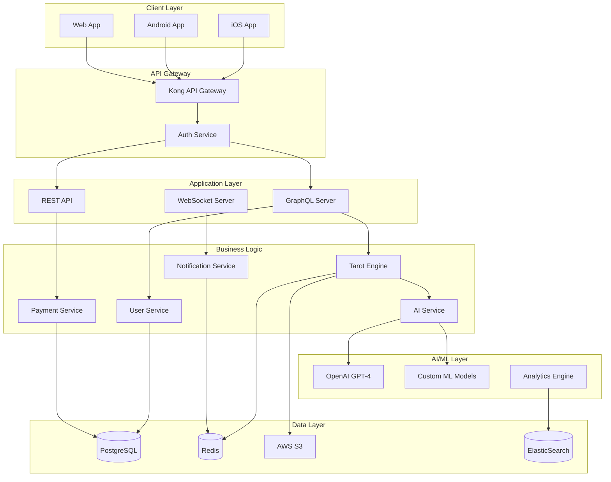

# 🔧 TarotMind 개발 기획서
## Technical Specification Document v1.0

---

## 📋 목차
1. [프로젝트 개요](#프로젝트-개요)
2. [시스템 아키텍처](#시스템-아키텍처)
3. [데이터베이스 설계](#데이터베이스-설계)
4. [API 설계](#api-설계)
5. [AI/ML 시스템](#aiml-시스템)
6. [UI/UX 상세 설계](#uiux-상세-설계)
7. [보안 및 인프라](#보안-및-인프라)
8. [개발 프로세스](#개발-프로세스)
9. [테스트 전략](#테스트-전략)
10. [배포 및 운영](#배포-및-운영)

---

## 1. 프로젝트 개요

### 1.1 프로젝트 정보
- **프로젝트명**: TarotMind
- **버전**: MVP v1.0
- **개발 기간**: 12주 (3개월)
- **플랫폼**: iOS, Android, Web
- **대상**: 18-35세 한국 MZ세대

### 1.2 기술 스택 결정

#### Frontend
```yaml
Mobile:
  Framework: React Native 0.72+
  State Management: Redux Toolkit + RTK Query
  Navigation: React Navigation 6
  UI Library: React Native Elements + Custom Components
  Animation: Lottie, Reanimated 3
  
Web:
  Framework: Next.js 14
  Language: TypeScript 5.0+
  Styling: Tailwind CSS + Emotion
  State: Zustand
```

#### Backend
```yaml
Server:
  Runtime: Node.js 20 LTS
  Framework: NestJS
  Language: TypeScript
  API: GraphQL (Apollo Server) + REST
  
Database:
  Primary: PostgreSQL 15
  Cache: Redis 7
  Search: Elasticsearch
  File Storage: AWS S3
```

#### Infrastructure
```yaml
Cloud: AWS
Container: Docker + Kubernetes (EKS)
CI/CD: GitHub Actions
Monitoring: DataDog + Sentry
CDN: CloudFront
```

---

## 2. 시스템 아키텍처

### 2.1 전체 아키텍처 다이어그램



### 2.2 마이크로서비스 구조

| 서비스 | 책임 | 기술 스택 | 포트 |
|--------|------|----------|------|
| API Gateway | 라우팅, 인증, 제한 | Kong | 8000 |
| Auth Service | 인증/인가 | Node.js + JWT | 3001 |
| User Service | 사용자 관리 | NestJS | 3002 |
| Tarot Service | 타로 리딩 엔진 | NestJS + Python | 3003 |
| Payment Service | 결제 처리 | NestJS | 3004 |
| Notification Service | 푸시/이메일 | Node.js | 3005 |
| AI Service | AI 처리 | Python FastAPI | 3006 |
| Analytics Service | 분석/추적 | Node.js | 3007 |

---

## 3. 데이터베이스 설계

### 3.1 주요 테이블 스키마

#### Users 테이블
```sql
CREATE TABLE users (
    id UUID PRIMARY KEY DEFAULT gen_random_uuid(),
    email VARCHAR(255) UNIQUE NOT NULL,
    username VARCHAR(50) UNIQUE,
    password_hash VARCHAR(255),
    phone VARCHAR(20),
    birth_date DATE,
    gender VARCHAR(10),
    zodiac_sign VARCHAR(20),
    subscription_tier VARCHAR(20) DEFAULT 'free',
    subscription_expires_at TIMESTAMP,
    coins INTEGER DEFAULT 0,
    created_at TIMESTAMP DEFAULT CURRENT_TIMESTAMP,
    updated_at TIMESTAMP DEFAULT CURRENT_TIMESTAMP,
    deleted_at TIMESTAMP,
    
    INDEX idx_email (email),
    INDEX idx_subscription (subscription_tier, subscription_expires_at)
);
```

#### Tarot_Cards 테이블
```sql
CREATE TABLE tarot_cards (
    id INTEGER PRIMARY KEY,
    name VARCHAR(100) NOT NULL,
    arcana VARCHAR(20) NOT NULL, -- 'major' or 'minor'
    suit VARCHAR(20), -- cups, wands, swords, pentacles
    number INTEGER,
    keywords JSONB,
    upright_meaning TEXT,
    reversed_meaning TEXT,
    description TEXT,
    image_url VARCHAR(500),
    symbolism JSONB,
    numerology INTEGER,
    element VARCHAR(20),
    astrological_sign VARCHAR(50),
    created_at TIMESTAMP DEFAULT CURRENT_TIMESTAMP,
    
    INDEX idx_arcana (arcana),
    INDEX idx_suit (suit)
);
```

#### Readings 테이블
```sql
CREATE TABLE readings (
    id UUID PRIMARY KEY DEFAULT gen_random_uuid(),
    user_id UUID REFERENCES users(id),
    spread_type VARCHAR(50) NOT NULL,
    question TEXT,
    cards JSONB NOT NULL, -- Array of card positions and orientations
    interpretation TEXT,
    ai_analysis JSONB,
    sentiment_score FLOAT,
    category VARCHAR(50), -- love, career, general, etc
    is_public BOOLEAN DEFAULT false,
    likes_count INTEGER DEFAULT 0,
    views_count INTEGER DEFAULT 0,
    created_at TIMESTAMP DEFAULT CURRENT_TIMESTAMP,
    
    INDEX idx_user_readings (user_id, created_at DESC),
    INDEX idx_public_readings (is_public, created_at DESC),
    INDEX idx_category (category)
);
```

#### Spreads 테이블
```sql
CREATE TABLE spreads (
    id SERIAL PRIMARY KEY,
    name VARCHAR(100) NOT NULL,
    card_count INTEGER NOT NULL,
    positions JSONB NOT NULL, -- Array of position definitions
    description TEXT,
    difficulty_level VARCHAR(20),
    category VARCHAR(50),
    is_premium BOOLEAN DEFAULT false,
    usage_count INTEGER DEFAULT 0,
    created_at TIMESTAMP DEFAULT CURRENT_TIMESTAMP,
    
    INDEX idx_premium (is_premium),
    INDEX idx_popular (usage_count DESC)
);
```

#### User_Analytics 테이블
```sql
CREATE TABLE user_analytics (
    id UUID PRIMARY KEY DEFAULT gen_random_uuid(),
    user_id UUID REFERENCES users(id),
    event_type VARCHAR(50) NOT NULL,
    event_data JSONB,
    session_id VARCHAR(100),
    device_info JSONB,
    ip_address INET,
    created_at TIMESTAMP DEFAULT CURRENT_TIMESTAMP,
    
    INDEX idx_user_events (user_id, created_at DESC),
    INDEX idx_event_type (event_type, created_at DESC)
);
```

### 3.2 Redis 데이터 구조

```yaml
# 세션 관리
session:{user_id}: 
  - token
  - device_info
  - expires_at

# 일일 리딩 제한
daily_reading:{user_id}:{date}:
  - count
  - TTL: 24 hours

# 캐싱
cache:reading:{reading_id}:
  - reading_data
  - TTL: 1 hour

cache:user:{user_id}:
  - user_profile
  - TTL: 30 minutes

# 실시간 통계
stats:daily:{date}:
  - total_readings
  - active_users
  - new_users
  
# 리더보드
leaderboard:readers:weekly:
  - sorted set of user_ids by reading_count
```

---

## 4. API 설계

### 4.1 GraphQL Schema

```graphql
# User Types
type User {
  id: ID!
  email: String!
  username: String
  profile: UserProfile!
  subscription: Subscription!
  stats: UserStats!
  readings: [Reading!]!
  createdAt: DateTime!
}

type UserProfile {
  birthDate: Date
  gender: Gender
  zodiacSign: ZodiacSign
  interests: [String!]
  avatar: String
}

type Subscription {
  tier: SubscriptionTier!
  expiresAt: DateTime
  coins: Int!
  features: [String!]!
}

# Tarot Types
type TarotCard {
  id: Int!
  name: String!
  arcana: Arcana!
  suit: Suit
  number: Int
  keywords: [String!]!
  meaning: CardMeaning!
  imageUrl: String!
  symbolism: Symbolism!
}

type Reading {
  id: ID!
  user: User!
  spread: Spread!
  question: String
  cards: [DrawnCard!]!
  interpretation: String!
  aiAnalysis: AIAnalysis
  category: ReadingCategory!
  sentiment: Float
  createdAt: DateTime!
}

type DrawnCard {
  position: Int!
  card: TarotCard!
  reversed: Boolean!
  positionMeaning: String!
}

# Queries
type Query {
  # User queries
  me: User!
  user(id: ID!): User
  
  # Tarot queries
  dailyCard: DrawnCard!
  reading(id: ID!): Reading
  myReadings(limit: Int, offset: Int): [Reading!]!
  
  # Card database
  cards(arcana: Arcana, suit: Suit): [TarotCard!]!
  card(id: Int!): TarotCard
  
  # Spreads
  spreads(category: String): [Spread!]!
  spread(id: ID!): Spread
}

# Mutations
type Mutation {
  # Auth
  register(input: RegisterInput!): AuthPayload!
  login(input: LoginInput!): AuthPayload!
  logout: Boolean!
  
  # User
  updateProfile(input: UpdateProfileInput!): User!
  
  # Readings
  createReading(input: CreateReadingInput!): Reading!
  likeReading(readingId: ID!): Reading!
  
  # Subscription
  subscribe(plan: SubscriptionTier!): Subscription!
  purchaseCoins(amount: Int!): User!
}

# Subscriptions
type Subscription {
  readingUpdated(readingId: ID!): Reading!
  dailyNotification: Notification!
}
```

### 4.2 REST API Endpoints

#### 인증 관련
```yaml
POST /api/auth/register
  Body: { email, password, birthDate }
  Response: { token, user }

POST /api/auth/login
  Body: { email, password }
  Response: { token, user }

POST /api/auth/refresh
  Body: { refreshToken }
  Response: { token, refreshToken }

POST /api/auth/logout
  Headers: { Authorization: Bearer <token> }
  Response: { success }
```

#### 타로 리딩
```yaml
POST /api/readings
  Headers: { Authorization }
  Body: { spreadType, question, category }
  Response: { reading }

GET /api/readings/:id
  Headers: { Authorization }
  Response: { reading }

GET /api/readings/daily
  Headers: { Authorization }
  Response: { card, message }

GET /api/readings/history
  Headers: { Authorization }
  Query: { page, limit, category }
  Response: { readings, total, hasMore }
```

#### 결제 관련
```yaml
POST /api/payments/subscribe
  Headers: { Authorization }
  Body: { plan, paymentMethod }
  Response: { subscription, invoice }

POST /api/payments/coins
  Headers: { Authorization }
  Body: { amount, paymentMethod }
  Response: { coins, transaction }

GET /api/payments/history
  Headers: { Authorization }
  Query: { page, limit }
  Response: { transactions, total }
```

### 4.3 WebSocket Events

```javascript
// Client -> Server
{
  "event": "join_reading",
  "data": { "readingId": "uuid" }
}

{
  "event": "request_live_interpretation",
  "data": { "readingId": "uuid", "question": "string" }
}

// Server -> Client
{
  "event": "interpretation_update",
  "data": { "partial": "string", "complete": false }
}

{
  "event": "daily_notification",
  "data": { "message": "string", "cardOfDay": {} }
}

{
  "event": "reading_shared",
  "data": { "userId": "uuid", "readingId": "uuid" }
}
```

---

## 5. AI/ML 시스템

### 5.1 AI 서비스 아키텍처

```python
# AI Service Structure
class TarotAIService:
    def __init__(self):
        self.gpt_client = OpenAIClient()
        self.sentiment_analyzer = SentimentAnalyzer()
        self.personalization_engine = PersonalizationEngine()
        self.pattern_recognizer = PatternRecognizer()
    
    async def generate_interpretation(
        self,
        cards: List[Card],
        spread: Spread,
        question: str,
        user_context: UserContext
    ) -> Interpretation:
        # 1. 카드 조합 분석
        card_patterns = self.pattern_recognizer.analyze(cards)
        
        # 2. 사용자 맞춤 컨텍스트 생성
        context = self.personalization_engine.create_context(
            user_context,
            question,
            card_patterns
        )
        
        # 3. GPT-4 해석 생성
        interpretation = await self.gpt_client.generate(
            prompt=self._build_prompt(cards, spread, context),
            temperature=0.7,
            max_tokens=1000
        )
        
        # 4. 감정 분석
        sentiment = self.sentiment_analyzer.analyze(interpretation)
        
        return Interpretation(
            text=interpretation,
            sentiment=sentiment,
            keywords=card_patterns.keywords,
            advice=self._extract_advice(interpretation)
        )
```

### 5.2 프롬프트 엔지니어링

```python
SYSTEM_PROMPT = """
You are an experienced tarot reader with deep knowledge of symbolism, 
psychology, and spiritual guidance. Your interpretations should be:
1. Insightful and meaningful
2. Personalized to the querent's situation
3. Balanced between spiritual and practical advice
4. Hopeful but realistic
5. Around 200-300 words

User Context:
- Age: {age}
- Interest: {interests}
- Previous themes: {themes}
- Current question: {question}
"""

CARD_INTERPRETATION_PROMPT = """
Cards drawn:
{cards_description}

Spread: {spread_name}
Positions: {positions}

Please provide an interpretation that:
1. Connects all cards into a cohesive narrative
2. Addresses the querent's question directly
3. Offers practical advice and action steps
4. Highlights the main message and theme
"""
```

### 5.3 개인화 알고리즘

```python
class PersonalizationEngine:
    def __init__(self):
        self.user_embeddings = {}
        self.reading_history = {}
        
    def create_user_embedding(self, user_id: str) -> np.ndarray:
        """사용자 벡터 생성"""
        history = self.get_user_history(user_id)
        
        features = {
            'reading_frequency': self.calculate_frequency(history),
            'preferred_categories': self.get_category_distribution(history),
            'sentiment_trend': self.analyze_sentiment_trend(history),
            'interaction_patterns': self.get_interaction_patterns(history),
            'demographic_features': self.get_demographics(user_id)
        }
        
        return self.vectorize_features(features)
    
    def recommend_spread(self, user_id: str, context: dict) -> str:
        """사용자에게 최적의 스프레드 추천"""
        user_embedding = self.create_user_embedding(user_id)
        spread_embeddings = self.get_spread_embeddings()
        
        scores = cosine_similarity(user_embedding, spread_embeddings)
        return self.spreads[np.argmax(scores)]
    
    def personalize_interpretation(
        self,
        base_interpretation: str,
        user_profile: UserProfile
    ) -> str:
        """해석 개인화"""
        # 사용자 선호 톤 적용
        tone_adjusted = self.adjust_tone(
            base_interpretation,
            user_profile.preferred_tone
        )
        
        # 관심사 키워드 강조
        interest_highlighted = self.highlight_interests(
            tone_adjusted,
            user_profile.interests
        )
        
        # 이전 피드백 반영
        feedback_applied = self.apply_feedback(
            interest_highlighted,
            user_profile.feedback_history
        )
        
        return feedback_applied
```

### 5.4 패턴 인식 시스템

```python
class PatternRecognizer:
    def __init__(self):
        self.patterns = self.load_patterns()
        
    def analyze(self, cards: List[Card]) -> PatternAnalysis:
        patterns_found = []
        
        # 1. 아르카나 분포 분석
        arcana_pattern = self.check_arcana_distribution(cards)
        if arcana_pattern:
            patterns_found.append(arcana_pattern)
        
        # 2. 숫자 패턴 분석
        number_pattern = self.check_number_patterns(cards)
        if number_pattern:
            patterns_found.append(number_pattern)
        
        # 3. 원소 균형 분석
        element_balance = self.analyze_elements(cards)
        patterns_found.append(element_balance)
        
        # 4. 카드 조합 시너지
        synergies = self.find_card_synergies(cards)
        patterns_found.extend(synergies)
        
        return PatternAnalysis(
            patterns=patterns_found,
            strength=self.calculate_pattern_strength(patterns_found),
            keywords=self.extract_keywords(patterns_found)
        )
```

---

## 6. UI/UX 상세 설계

### 6.1 디자인 시스템

#### 색상 팔레트
```css
:root {
  /* Primary Colors */
  --primary-purple: #6B46C1;
  --primary-gold: #F59E0B;
  --primary-midnight: #1E293B;
  
  /* Secondary Colors */
  --mystic-blue: #3B82F6;
  --cosmic-pink: #EC4899;
  --sage-green: #10B981;
  
  /* Neutral Colors */
  --gray-900: #111827;
  --gray-700: #374151;
  --gray-500: #6B7280;
  --gray-300: #D1D5DB;
  --gray-100: #F3F4F6;
  
  /* Gradient */
  --mystic-gradient: linear-gradient(135deg, #667eea 0%, #764ba2 100%);
  --gold-gradient: linear-gradient(135deg, #f093fb 0%, #f5576c 100%);
}
```

#### 타이포그래피
```css
/* Font System */
--font-display: 'Playfair Display', serif;  /* 제목 */
--font-body: 'Inter', sans-serif;           /* 본문 */
--font-mystic: 'Cinzel', serif;             /* 신비로운 텍스트 */

/* Font Sizes */
--text-xs: 0.75rem;    /* 12px */
--text-sm: 0.875rem;   /* 14px */
--text-base: 1rem;     /* 16px */
--text-lg: 1.125rem;   /* 18px */
--text-xl: 1.25rem;    /* 20px */
--text-2xl: 1.5rem;    /* 24px */
--text-3xl: 1.875rem;  /* 30px */
--text-4xl: 2.25rem;   /* 36px */
```

### 6.2 핵심 화면 설계

#### 홈 화면
```javascript
const HomeScreen = {
  components: [
    {
      type: 'Header',
      content: {
        greeting: '안녕하세요, {username}님',
        subtitle: '오늘의 운세를 확인해보세요'
      }
    },
    {
      type: 'DailyCard',
      animation: 'fadeInScale',
      interaction: 'tap-to-reveal'
    },
    {
      type: 'QuickActions',
      items: [
        { icon: 'cards', label: '타로 리딩', action: 'navigate:reading' },
        { icon: 'history', label: '지난 리딩', action: 'navigate:history' },
        { icon: 'learn', label: '카드 배우기', action: 'navigate:learn' }
      ]
    },
    {
      type: 'RecentReadings',
      limit: 3,
      layout: 'horizontal-scroll'
    }
  ]
};
```

#### 카드 뽑기 화면
```javascript
const CardDrawScreen = {
  steps: [
    {
      id: 'question',
      component: 'QuestionInput',
      validation: 'required|min:10',
      placeholder: '마음속 질문을 떠올려보세요...'
    },
    {
      id: 'shuffle',
      component: 'CardShuffle',
      animation: 'physics-based',
      duration: 3000,
      hapticFeedback: true
    },
    {
      id: 'select',
      component: 'CardSelection',
      layout: 'spread',
      selectable: true,
      maxSelection: 'spread-dependent'
    },
    {
      id: 'reveal',
      component: 'CardReveal',
      animation: 'flip-3d',
      stagger: 500
    },
    {
      id: 'interpretation',
      component: 'InterpretationDisplay',
      features: ['text-to-speech', 'save', 'share']
    }
  ]
};
```

### 6.3 애니메이션 시스템

```javascript
// 카드 애니메이션 정의
const cardAnimations = {
  shuffle: {
    type: 'spring',
    stiffness: 100,
    damping: 15,
    mass: 1
  },
  flip: {
    duration: 600,
    easing: 'cubic-bezier(0.455, 0.03, 0.515, 0.955)',
    transformStyle: 'preserve-3d'
  },
  float: {
    duration: 3000,
    loop: true,
    easing: 'ease-in-out',
    keyframes: [
      { transform: 'translateY(0px)' },
      { transform: 'translateY(-10px)' },
      { transform: 'translateY(0px)' }
    ]
  },
  glow: {
    duration: 2000,
    loop: true,
    keyframes: [
      { boxShadow: '0 0 5px rgba(107, 70, 193, 0.5)' },
      { boxShadow: '0 0 20px rgba(107, 70, 193, 0.8)' },
      { boxShadow: '0 0 5px rgba(107, 70, 193, 0.5)' }
    ]
  }
};
```

### 6.4 반응형 디자인

```css
/* Breakpoints */
--mobile: 320px;
--tablet: 768px;
--desktop: 1024px;
--wide: 1440px;

/* Layout Grid */
.container {
  width: 100%;
  margin: 0 auto;
  padding: 0 16px;
}

@media (min-width: 768px) {
  .container {
    max-width: 750px;
    padding: 0 24px;
  }
}

@media (min-width: 1024px) {
  .container {
    max-width: 1000px;
    padding: 0 32px;
  }
}

/* Card Grid Responsive */
.card-grid {
  display: grid;
  gap: 16px;
  grid-template-columns: 1fr;
}

@media (min-width: 768px) {
  .card-grid {
    grid-template-columns: repeat(2, 1fr);
  }
}

@media (min-width: 1024px) {
  .card-grid {
    grid-template-columns: repeat(3, 1fr);
  }
}
```

---

## 7. 보안 및 인프라

### 7.1 보안 체크리스트

#### 인증 및 인가
- [x] JWT 토큰 구현 (Access + Refresh)
- [x] 토큰 만료 시간 설정 (Access: 1h, Refresh: 7d)
- [x] Rate Limiting (IP당 분당 60 요청)
- [x] CORS 정책 설정
- [x] OAuth 2.0 소셜 로그인 (Google, Apple, Kakao)

#### 데이터 보호
- [x] 비밀번호 해싱 (bcrypt, salt rounds: 12)
- [x] 민감 정보 암호화 (AES-256)
- [x] SQL Injection 방지 (Parameterized Queries)
- [x] XSS 방지 (Input Sanitization)
- [x] HTTPS 적용 (SSL/TLS)

#### 결제 보안
- [x] PCI DSS 준수
- [x] 카드 정보 미저장 (토큰화)
- [x] 결제 검증 이중화
- [x] 환불 정책 및 프로세스

### 7.2 AWS 인프라 구성

```yaml
# Infrastructure as Code (Terraform)
resource "aws_vpc" "main" {
  cidr_block = "10.0.0.0/16"
  
  tags = {
    Name = "tarotmind-vpc"
  }
}

resource "aws_eks_cluster" "main" {
  name     = "tarotmind-cluster"
  role_arn = aws_iam_role.eks.arn
  
  vpc_config {
    subnet_ids = aws_subnet.private[*].id
  }
}

resource "aws_rds_cluster" "postgres" {
  cluster_identifier      = "tarotmind-db"
  engine                  = "aurora-postgresql"
  engine_version          = "15.2"
  database_name           = "tarotmind"
  master_username         = "admin"
  master_password         = var.db_password
  backup_retention_period = 7
  preferred_backup_window = "03:00-04:00"
}

resource "aws_elasticache_cluster" "redis" {
  cluster_id           = "tarotmind-cache"
  engine               = "redis"
  node_type            = "cache.t3.micro"
  num_cache_nodes      = 1
  parameter_group_name = "default.redis7"
}

resource "aws_s3_bucket" "assets" {
  bucket = "tarotmind-assets"
  
  cors_rule {
    allowed_headers = ["*"]
    allowed_methods = ["GET", "HEAD"]
    allowed_origins = ["*"]
    max_age_seconds = 3000
  }
}
```

### 7.3 모니터링 및 로깅

```yaml
# DataDog Configuration
monitors:
  - name: "API Response Time"
    type: metric
    query: "avg(last_5m):avg:trace.express.request{service:tarotmind-api} > 1000"
    message: "API response time is above 1 second"
    
  - name: "Error Rate"
    type: metric
    query: "avg(last_5m):sum:trace.express.request.errors{service:tarotmind-api} > 100"
    message: "High error rate detected"
    
  - name: "Database Connection Pool"
    type: metric
    query: "avg(last_5m):avg:postgresql.connections{db:tarotmind} > 90"
    message: "Database connection pool usage is high"

# Logging Strategy
logging:
  levels:
    production: INFO
    staging: DEBUG
    development: DEBUG
    
  outputs:
    - type: CloudWatch
      logGroup: /aws/eks/tarotmind
      
    - type: ElasticSearch
      index: tarotmind-logs
      
  structured_logging:
    format: JSON
    fields:
      - timestamp
      - level
      - message
      - service
      - traceId
      - userId
      - error
```

---

## 8. 개발 프로세스

### 8.1 Sprint 계획 (2주 단위)

#### Sprint 1-2: 기초 설정
- 프로젝트 초기 설정
- 개발 환경 구축
- CI/CD 파이프라인 설정
- 데이터베이스 설계 및 구축

#### Sprint 3-4: 핵심 백엔드
- 사용자 인증 시스템
- 타로 카드 데이터 모델
- 기본 API 구현
- 타로 엔진 프로토타입

#### Sprint 5-6: 프론트엔드 기초
- 앱 기본 구조
- UI 컴포넌트 라이브러리
- 홈 화면 및 네비게이션
- 카드 뷰어 구현

#### Sprint 7-8: 리딩 시스템
- 스프레드 시스템 구현
- 카드 셔플 및 선택 로직
- AI 해석 통합
- 리딩 히스토리

#### Sprint 9-10: 개인화 및 결제
- 개인화 엔진 구현
- 구독 시스템
- 결제 통합
- 푸시 알림

#### Sprint 11-12: 최적화 및 출시
- 성능 최적화
- 보안 점검
- 베타 테스트
- 출시 준비

### 8.2 개발 워크플로우

```yaml
Git Flow:
  main: 프로덕션 배포 브랜치
  develop: 개발 통합 브랜치
  feature/*: 기능 개발 브랜치
  hotfix/*: 긴급 수정 브랜치
  release/*: 릴리즈 준비 브랜치

Commit Convention:
  feat: 새로운 기능
  fix: 버그 수정
  docs: 문서 수정
  style: 코드 포맷팅
  refactor: 코드 리팩토링
  test: 테스트 추가
  chore: 빌드 업무 수정

PR Process:
  1. Feature 브랜치 생성
  2. 개발 및 테스트
  3. PR 생성
  4. Code Review (최소 1명)
  5. CI 통과 확인
  6. Merge to develop
```

### 8.3 코드 품질 관리

```javascript
// ESLint Configuration
module.exports = {
  extends: [
    'eslint:recommended',
    'plugin:@typescript-eslint/recommended',
    'plugin:react/recommended',
    'prettier'
  ],
  rules: {
    'no-console': 'warn',
    'no-unused-vars': 'error',
    'prefer-const': 'error',
    '@typescript-eslint/explicit-module-boundary-types': 'error'
  }
};

// Jest Configuration
module.exports = {
  preset: 'ts-jest',
  testEnvironment: 'node',
  coverageThreshold: {
    global: {
      branches: 80,
      functions: 80,
      lines: 80,
      statements: 80
    }
  }
};
```

---

## 9. 테스트 전략

### 9.1 테스트 피라미드

```
         E2E Tests (10%)
        /            \
       /              \
    Integration Tests (30%)
    /                    \
   /                      \
  Unit Tests (60%)
```

### 9.2 테스트 구현

#### Unit Tests
```typescript
// Card Service Test
describe('TarotCardService', () => {
  let service: TarotCardService;
  
  beforeEach(() => {
    service = new TarotCardService();
  });
  
  describe('shuffleCards', () => {
    it('should return 78 cards', () => {
      const shuffled = service.shuffleCards();
      expect(shuffled).toHaveLength(78);
    });
    
    it('should return cards in different order', () => {
      const first = service.shuffleCards();
      const second = service.shuffleCards();
      expect(first).not.toEqual(second);
    });
  });
  
  describe('drawCards', () => {
    it('should draw specified number of cards', () => {
      const cards = service.drawCards(3);
      expect(cards).toHaveLength(3);
    });
    
    it('should not draw duplicate cards', () => {
      const cards = service.drawCards(10);
      const uniqueCards = new Set(cards.map(c => c.id));
      expect(uniqueCards.size).toBe(10);
    });
  });
});
```

#### Integration Tests
```typescript
// API Integration Test
describe('POST /api/readings', () => {
  it('should create a new reading', async () => {
    const response = await request(app)
      .post('/api/readings')
      .set('Authorization', `Bearer ${token}`)
      .send({
        spreadType: 'three-card',
        question: 'What should I focus on today?',
        category: 'general'
      });
    
    expect(response.status).toBe(201);
    expect(response.body).toHaveProperty('reading');
    expect(response.body.reading).toHaveProperty('id');
    expect(response.body.reading.cards).toHaveLength(3);
  });
  
  it('should enforce daily limit for free users', async () => {
    // Create first reading
    await createReading(freeUserToken);
    
    // Try second reading
    const response = await createReading(freeUserToken);
    
    expect(response.status).toBe(429);
    expect(response.body.error).toBe('Daily reading limit reached');
  });
});
```

#### E2E Tests
```typescript
// Cypress E2E Test
describe('Complete Reading Flow', () => {
  beforeEach(() => {
    cy.login('test@example.com', 'password123');
  });
  
  it('should complete a three-card reading', () => {
    // Navigate to reading
    cy.visit('/');
    cy.get('[data-testid="start-reading"]').click();
    
    // Select spread
    cy.get('[data-testid="spread-three-card"]').click();
    
    // Enter question
    cy.get('[data-testid="question-input"]')
      .type('What should I focus on in my career?');
    cy.get('[data-testid="continue-button"]').click();
    
    // Shuffle cards
    cy.get('[data-testid="shuffle-button"]').click();
    cy.wait(3000); // Wait for animation
    
    // Select cards
    cy.get('[data-testid^="card-"]').first().click();
    cy.get('[data-testid^="card-"]').eq(10).click();
    cy.get('[data-testid^="card-"]').last().click();
    
    // View interpretation
    cy.get('[data-testid="reveal-button"]').click();
    cy.get('[data-testid="interpretation"]').should('be.visible');
    cy.get('[data-testid="save-reading"]').click();
    
    // Verify saved
    cy.visit('/history');
    cy.get('[data-testid="reading-list"]')
      .children()
      .should('have.length.at.least', 1);
  });
});
```

### 9.3 성능 테스트

```javascript
// K6 Load Testing Script
import http from 'k6/http';
import { check, sleep } from 'k6';

export const options = {
  stages: [
    { duration: '2m', target: 100 }, // Ramp up
    { duration: '5m', target: 100 }, // Stay at 100 users
    { duration: '2m', target: 200 }, // Ramp up to 200
    { duration: '5m', target: 200 }, // Stay at 200
    { duration: '2m', target: 0 },   // Ramp down
  ],
  thresholds: {
    http_req_duration: ['p(95)<500'], // 95% of requests under 500ms
    http_req_failed: ['rate<0.1'],    // Error rate under 10%
  },
};

export default function () {
  // Login
  const loginRes = http.post(`${__ENV.API_URL}/auth/login`, {
    email: 'test@example.com',
    password: 'password123',
  });
  
  check(loginRes, {
    'login successful': (r) => r.status === 200,
  });
  
  const token = loginRes.json('token');
  
  // Create reading
  const readingRes = http.post(
    `${__ENV.API_URL}/readings`,
    {
      spreadType: 'daily',
      category: 'general',
    },
    {
      headers: { Authorization: `Bearer ${token}` },
    }
  );
  
  check(readingRes, {
    'reading created': (r) => r.status === 201,
    'has interpretation': (r) => r.json('reading.interpretation') !== null,
  });
  
  sleep(1);
}
```

---

## 10. 배포 및 운영

### 10.1 CI/CD Pipeline

```yaml
# .github/workflows/deploy.yml
name: Deploy to Production

on:
  push:
    branches: [main]

jobs:
  test:
    runs-on: ubuntu-latest
    steps:
      - uses: actions/checkout@v3
      
      - name: Setup Node.js
        uses: actions/setup-node@v3
        with:
          node-version: '20'
          
      - name: Install dependencies
        run: npm ci
        
      - name: Run tests
        run: npm test -- --coverage
        
      - name: Upload coverage
        uses: codecov/codecov-action@v3
        
  build:
    needs: test
    runs-on: ubuntu-latest
    steps:
      - uses: actions/checkout@v3
      
      - name: Build Docker image
        run: |
          docker build -t tarotmind-api:${{ github.sha }} .
          docker tag tarotmind-api:${{ github.sha }} ${{ secrets.ECR_REGISTRY }}/tarotmind-api:latest
          
      - name: Push to ECR
        run: |
          aws ecr get-login-password --region ap-northeast-2 | docker login --username AWS --password-stdin ${{ secrets.ECR_REGISTRY }}
          docker push ${{ secrets.ECR_REGISTRY }}/tarotmind-api:latest
          
  deploy:
    needs: build
    runs-on: ubuntu-latest
    steps:
      - name: Deploy to EKS
        run: |
          aws eks update-kubeconfig --name tarotmind-cluster --region ap-northeast-2
          kubectl set image deployment/api api=${{ secrets.ECR_REGISTRY }}/tarotmind-api:latest
          kubectl rollout status deployment/api
```

### 10.2 모바일 앱 배포

#### iOS 배포 체크리스트
- [ ] App Store Connect 계정 설정
- [ ] 앱 ID 및 번들 ID 등록
- [ ] 프로비저닝 프로파일 생성
- [ ] 앱 아이콘 (1024x1024) 준비
- [ ] 스크린샷 준비 (각 디바이스 크기별)
- [ ] 앱 설명 및 키워드 최적화
- [ ] 연령 등급 설정
- [ ] TestFlight 베타 테스트
- [ ] 심사 제출

#### Android 배포 체크리스트
- [ ] Google Play Console 계정 설정
- [ ] 앱 서명 키 생성 및 관리
- [ ] 앱 번들 (.aab) 빌드
- [ ] 스토어 등록정보 작성
- [ ] 콘텐츠 등급 설정
- [ ] 타겟 국가 및 언어 설정
- [ ] 가격 및 배포 설정
- [ ] 내부/베타 테스트
- [ ] 프로덕션 출시

### 10.3 운영 매뉴얼

#### 일일 체크리스트
```bash
# 시스템 상태 확인
kubectl get pods -n production
kubectl top nodes
kubectl top pods -n production

# 로그 확인
kubectl logs -f deployment/api -n production
aws cloudwatch tail /aws/eks/tarotmind --follow

# 메트릭 확인
- API 응답 시간
- 에러율
- 활성 사용자 수
- 데이터베이스 연결 수
```

#### 장애 대응 프로세스
```yaml
Severity Levels:
  P1: 전체 서비스 다운
    - Response Time: 15분 이내
    - Resolution Time: 1시간 이내
    
  P2: 주요 기능 장애
    - Response Time: 30분 이내
    - Resolution Time: 4시간 이내
    
  P3: 부분 기능 장애
    - Response Time: 2시간 이내
    - Resolution Time: 24시간 이내
    
  P4: 마이너 이슈
    - Response Time: 24시간 이내
    - Resolution Time: 72시간 이내

Escalation Path:
  1. On-call Engineer
  2. Team Lead
  3. CTO
  4. CEO
```

#### 백업 및 복구
```bash
# 데이터베이스 백업
pg_dump -h $DB_HOST -U $DB_USER -d tarotmind > backup_$(date +%Y%m%d).sql

# S3 백업
aws s3 sync s3://tarotmind-assets s3://tarotmind-backup-assets

# 복구 절차
psql -h $DB_HOST -U $DB_USER -d tarotmind < backup_20250114.sql
```

---

## 📊 성공 지표 모니터링

### 기술적 KPI
| 지표 | 목표 | 측정 방법 |
|------|------|----------|
| API 응답시간 (p95) | < 500ms | DataDog APM |
| 에러율 | < 0.1% | Sentry |
| 가동시간 | > 99.9% | StatusPage |
| 앱 크래시율 | < 1% | Firebase Crashlytics |
| 앱 로딩 시간 | < 3초 | Firebase Performance |

### 비즈니스 KPI
| 지표 | 목표 (3개월) | 측정 방법 |
|------|-------------|----------|
| DAU | 10,000 | Google Analytics |
| MAU | 50,000 | Google Analytics |
| 유지율 (D30) | > 40% | Amplitude |
| 유료 전환율 | > 3% | Internal Analytics |
| ARPU | ₩5,000 | Revenue / MAU |
| 앱스토어 평점 | > 4.5 | App Store, Play Store |

---

## 🔚 결론

본 개발 기획서는 TarotMind 앱의 기술적 구현을 위한 상세 가이드입니다. 

### 핵심 성공 요소
1. **안정적인 아키텍처**: 마이크로서비스 기반 확장 가능한 설계
2. **AI 통합**: GPT-4 기반 개인화된 해석 제공
3. **우수한 UX**: 직관적이고 매력적인 사용자 경험
4. **데이터 기반 운영**: 지속적인 모니터링과 개선

### 다음 단계
1. 개발팀 구성 완료
2. 상세 태스크 분배
3. Sprint 1 킥오프
4. 주간 진행상황 리뷰

---

**문서 버전**: v1.0  
**작성일**: 2025년 1월 14일  
**작성자**: TarotMind Development Team  
**검토자**: CTO, Tech Lead, Product Manager
